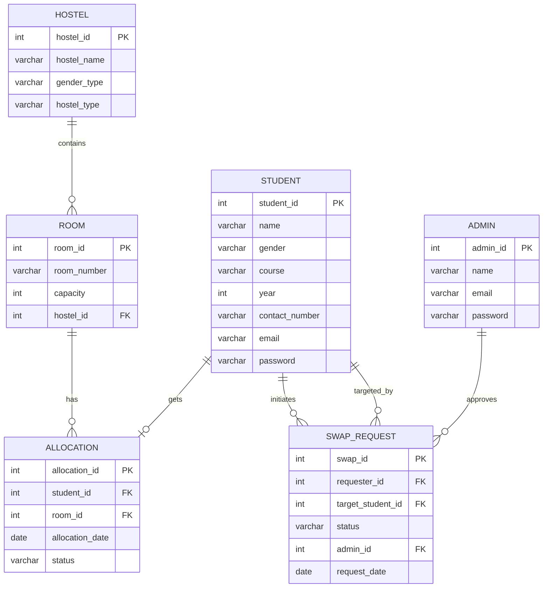

# Entity-Relationship (ER) Diagram

```mermaid
erDiagram
    ADMIN {
        int admin_id PK
        varchar name
        varchar email
        varchar password
    }

    STUDENT {
        int student_id PK
        varchar name
        varchar gender
        varchar course
        int year
        varchar contact_number
        varchar email
        varchar password
    }

    HOSTEL {
        int hostel_id PK
        varchar hostel_name
        varchar gender_type
        varchar hostel_type
    }

    ROOM {
        int room_id PK
        varchar room_number
        int capacity
        int hostel_id FK
    }

    ALLOCATION {
        int allocation_id PK
        int student_id FK
        int room_id FK
        date allocation_date
        varchar status
    }

    SWAP_REQUEST {
        int swap_id PK
        int requester_id FK
        int target_student_id FK
        varchar status
        int admin_id FK
        date request_date
    }

    %% Relationships
    HOSTEL ||--o{ ROOM : contains
    ROOM ||--o{ ALLOCATION : has
    STUDENT ||--o| ALLOCATION : gets
    STUDENT ||--o{ SWAP_REQUEST : initiates
    STUDENT ||--o{ SWAP_REQUEST : targeted_by
    ADMIN ||--o{ SWAP_REQUEST : approves
```
