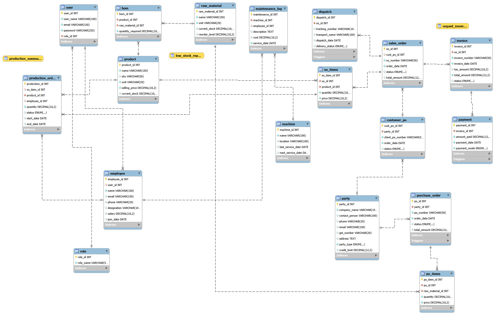

# BizFlow ERP

A full-stack ERP system for small and medium manufacturing businesses. Manages inventory, purchase, sales, production, HR, maintenance and finance in a centralized platform.

---

## Table of Contents

- [Project Overview](#project-overview)
- [Tech Stack](#tech-stack)
- [Team](#team)
- [Folder Structure](#folder-structure)
- [Setup Instructions](#setup-instructions)
- [Database Setup](#database-setup)
- [Running Smoke Tests](#running-smoke-tests)
- [Environment Variables](#environment-variables)
- [Database Design](#database-design)
- [API Reference](#api-reference)
- [Roles & Permissions](#roles--permissions)
- [Testing & Explanation](#testing--explanation--sql-concepts-demonstrated)

---

## Project Overview

BizFlow ERP is a modular enterprise resource planning application built for small-to-medium manufacturing businesses. It provides core modules for Inventory, Purchase, Sales, Production, HR, Maintenance and Reports with a RESTful API backend and a React + Vite frontend.

### High-Level Architecture

```
Auth Module
│
├── Inventory Module
├── Purchase Module
├── Sales Module
├── Production Module
├── HR Module
├── Maintenance Module
└── Reports Module
```

### Core Modules

1. **Inventory** — Raw material and finished goods tracking, reorder level alerts, BOM
2. **Purchase** — Purchase Orders, GRN, auto stock update via trigger
3. **Sales** — Sales Orders, Invoices, Payments, Dispatch
4. **Production** — BOM-based production, atomic stock deduction via stored procedure
5. **HR** — Employee profiles, designations, salary
6. **Maintenance** — Machine tracking, service logs, service date management
7. **Reports** — Advanced SQL queries demonstrating GROUP BY, HAVING, Subqueries, JOINs, Functions

---

## Tech Stack

| Layer     | Technology            |
|-----------|-----------------------|
| Frontend  | React + Vite          |
| Backend   | Node.js + Express.js  |
| Database  | MySQL 8               |
| Auth      | JWT + bcrypt          |

---

## Team

| Role   | Name           |
|--------|----------------|
| SPOC   | Sumit Sharma   |
| Member | Ayansh Pandey  |
| Member | Sumit Sharma   |
| Member | Lakshay        |
| Member | Ashish Kumar   |

**Group:** 8

---

## Folder Structure

```
biz-flow/
├── index.html
├── package.json
├── vite.config.js
├── README.md
├── backend/
│   ├── server.js
│   └── src/
│       ├── config/
│       │   └── db.js
│       ├── controllers/
│       │   ├── authController.js
│       │   ├── inventoryController.js
│       │   ├── purchaseController.js
│       │   ├── salesController.js
│       │   ├── productionController.js
│       │   ├── hrController.js
│       │   ├── maintenanceController.js
│       │   └── reportsController.js
│       ├── middlewares/
│       │   └── authMiddleware.js
│       ├── models/
│       │   ├── userModel.js
│       │   ├── inventoryModel.js
│       │   ├── purchaseModel.js
│       │   ├── salesModel.js
│       │   ├── productionModel.js
│       │   ├── hrModel.js
│       │   ├── maintenanceModel.js
│       │   └── reportsModel.js
│       └── routes/
│           ├── authRoutes.js
│           ├── inventoryRoutes.js
│           ├── purchaseRoutes.js
│           ├── salesRoutes.js
│           ├── productionRoutes.js
│           ├── hrRoutes.js
│           ├── maintenanceRoutes.js
│           └── reportsRoutes.js
└── src/  (React frontend)
    ├── App.jsx
    ├── index.css
    ├── main.jsx
    ├── components/
    │   └── Layout.jsx
    └── pages/
        ├── Login.jsx
        ├── SignUp.jsx
        ├── Dashboard.jsx
        ├── Inventory.jsx
        ├── Purchase.jsx
        ├── Sales.jsx
        ├── Production.jsx
        ├── HR.jsx
        ├── Maintenance.jsx
        └── Reports.jsx
```

---

## Setup Instructions

### Prerequisites

- Node.js v18+
- MySQL 8+
- npm

### 1. Clone the repository

```bash
git clone <repo-url>
cd biz-flow
```

### 2. Setup the database

Open MySQL Workbench or MySQL CLI and run:

```bash
mysql -u root -p < backend/database/schema.sql
```

Or manually execute the DDL statements to create the `bizflow` database and all 18 tables.

### 3. Configure environment variables

Create a `.env` file inside the `backend/` folder:

```env
PORT=3000
DB_HOST=localhost
DB_PORT=3306
DB_USER=root
DB_PASSWORD=your_db_password
DB_NAME=bizflow
JWT_SECRET=your_jwt_secret
DEFAULT_ROLE_ID=5
```

### 4. Install backend dependencies

```bash
npm install
npm install --save-dev nodemon
```
### 5. Start the frontend & Backend 

```bash
npm run dev
```


---

## Database Setup

### Schema & Seed Files

The database is separated into two files for better organization:

- **`backend/database/schema.sql`** — Contains only DDL (CREATE TABLE), triggers, views, and stored procedures
- **`backend/database/seed.sql`** — Contains sample data (INSERTs) for demo purposes

### Quick Setup (Automated)

Use npm scripts to automate database setup:

```bash
# 1. Import schema (creates all tables, triggers, views, stored procedures)
npm run db:import

# 2. Import seed data (adds sample data + admin user)
npm run db:seed
```

Or do it manually:

```bash
# Create database and import schema
mysql -u root -p < backend/database/schema.sql

# Import seed data
mysql -u root -p bizflow < backend/database/seed.sql
```

### Demo Admin Account

**Email:** `admin@bizflow.local`  
**Password:** `Admin@123`  
**Role:** Admin (full access)

*Password is bcrypt-hashed in the database.*

---

## Running Smoke Tests

Smoke tests validate that your entire application stack works correctly:
- ✅ Database setup (schema + seed)
- ✅ Backend server starts
- ✅ API endpoints are accessible
- ✅ Authentication works
- ✅ Core endpoints return valid data

### Run Tests

```bash
npm run test:smoke
```

### Expected Output

```
ℹ️  Running smoke tests...

ℹ️  Setting up database...
✅ Database reset: bizflow
✅ Executed: schema.sql
✅ Executed: seed.sql
✅ Database setup complete
ℹ️  Starting backend server...
✅ Backend server started
ℹ️  Waiting for API to be ready...
✅ API is ready

--- API Tests ---

ℹ️  Testing admin login...
✅ Admin login successful
ℹ️  Testing reports endpoint...
✅ Reports endpoint works (returned 2 items)
ℹ️  Testing inventory endpoint...
✅ Inventory endpoint works (returned 6 materials)

--- Test Summary ---
✅ Passed: 3
❌ Failed: 0
✅ All smoke tests passed! ✨
```

### What the Smoke Test Does

1. **Resets database** — Drops and recreates the `bizflow` database
2. **Imports schema** — Runs all DDL, triggers, views, and stored procedures
3. **Imports seed data** — Populates sample data and demo admin user
4. **Starts backend** — Spawns Node.js server on port 3000
5. **Tests login** — Authenticates with demo admin credentials
6. **Tests reports** — Validates report endpoint returns data
7. **Tests inventory** — Validates inventory endpoint returns data
8. **Reports results** — Shows pass/fail summary

---

## Environment Variables

### Setup `.env` file

1. Copy `.env.example` to `.env` (or create manually):

```bash
cp .env.example .env
```

2. Update values with your environment:

```env
PORT=3000
DB_HOST=localhost
DB_PORT=3306
DB_USER=root
DB_PASSWORD=your_db_password
DB_NAME=bizflow
JWT_SECRET=your_jwt_secret_key_here
DEFAULT_ROLE_ID=5
```

### Environment Variables Reference

| Variable         | Description                        | Example            | Required |
|------------------|------------------------------------|--------------------|----------|
| PORT             | Backend server port                | 3000               | ✅       |
| DB_HOST          | MySQL host                         | localhost          | ✅       |
| DB_PORT          | MySQL port                         | 3306               | ✅       |
| DB_USER          | MySQL username                     | root               | ✅       |
| DB_PASSWORD      | MySQL password                     | yourpassword       | ✅       |
| DB_NAME          | MySQL database name                | bizflow            | ✅       |
| JWT_SECRET       | Secret key for JWT signing         | your_secret_key    | ✅       |
| DEFAULT_ROLE_ID  | Default role assigned on register  | 5                  | ❌       |

---

## Database Design

### ER Diagram



*Entity-Relationship Diagram showing all 18 tables, primary keys, foreign keys, and cardinality relationships.*

### Tables (18)

| Table              | Description                               |
|--------------------|-------------------------------------------|
| role               | System roles (Admin, Manager, etc.)       |
| user               | System users with role assignment         |
| party              | Unified vendor and customer table         |
| raw_material       | Raw material inventory                    |
| product            | Finished goods / products                 |
| bom                | Bill of Materials (product ↔ raw_material)|
| purchase_order     | Vendor purchase orders                    |
| po_items           | Line items for each purchase order        |
| customer_po        | Customer purchase orders                  |
| sales_order        | Internal sales orders                     |
| so_items           | Line items for each sales order           |
| invoice            | Invoices linked to sales orders           |
| payment            | Payments against invoices                 |
| dispatch           | Dispatch and delivery tracking            |
| production_order   | Production orders linked to BOM           |
| employee           | Employee profiles                         |
| machine            | Machine registry                          |
| maintenance_log    | Machine service history                   |

### Triggers (3)

| Trigger                      | Event                          | Action                                           |
|------------------------------|--------------------------------|--------------------------------------------------|
| `trg_grn_stock_update`       | AFTER UPDATE on purchase_order | Auto-updates raw_material.current_stock on GRN   |
| `trg_dispatch_update_so`     | AFTER INSERT on dispatch       | Auto-updates sales_order.status to 'dispatched'  |
| `trg_payment_update_invoice` | AFTER INSERT on payment        | Auto-updates invoice.status to 'paid'/'partial'  |

### Views (3)

| View                 | Description                                      |
|----------------------|--------------------------------------------------|
| `low_stock_report`   | Raw materials below reorder level                |
| `unpaid_invoices`    | Outstanding invoices with customer details       |
| `production_summary` | Production orders with product and employee info |

### Stored Procedure (1)

| Procedure                    | Description                                                                  |
|------------------------------|------------------------------------------------------------------------------|
| `ProcessProductionOrder(id)` | Atomically deducts raw materials via BOM and updates finished goods stock. Runs inside a BEGIN/COMMIT transaction. Rolls back if stock is insufficient. |

### Key Relationships

- `user` → `role` (Many-to-One)
- `party` → `purchase_order` (One-to-Many)
- `party` → `customer_po` (One-to-Many)
- `product` ↔ `raw_material` via `bom` (Many-to-Many)
- `sales_order` → `invoice` → `payment` (One-to-Many chain)
- `employee` → `user` (Many-to-One, nullable)

---

## API Reference

All protected routes require header: `Authorization: Bearer <token>`

### AUTH (base: `/api`)

| Method | Endpoint  | Description                  | Auth |
|--------|-----------|------------------------------|------|
| POST   | /login    | Authenticate and return JWT  | ❌   |
| POST   | /register | Create new user account      | ❌   |

### INVENTORY (base: `/api/inventory`)

| Method | Endpoint           | Description               | Auth |
|--------|--------------------|---------------------------|------|
| GET    | /raw-materials     | List all raw materials    | ✅   |
| GET    | /raw-materials/:id | Get raw material by ID    | ✅   |
| POST   | /raw-materials     | Create raw material       | ✅   |
| PUT    | /raw-materials/:id | Update raw material       | ✅   |
| DELETE | /raw-materials/:id | Delete raw material       | ✅   |
| GET    | /products          | List all products         | ✅   |
| GET    | /products/:id      | Get product by ID         | ✅   |
| POST   | /products          | Create product            | ✅   |
| PUT    | /products/:id      | Update product            | ✅   |
| DELETE | /products/:id      | Delete product            | ✅   |
| GET    | /low-stock         | Items below reorder level | ✅   |

### PURCHASE (base: `/api/purchase`)

| Method | Endpoint    | Description                         | Auth |
|--------|-------------|-------------------------------------|------|
| GET    | /           | List all purchase orders            | ✅   |
| GET    | /:id        | Get purchase order with items       | ✅   |
| POST   | /           | Create purchase order               | ✅   |
| PATCH  | /:id/grn    | Receive GRN — triggers stock update | ✅   |
| PATCH  | /:id/status | Update purchase order status        | ✅   |

### SALES (base: `/api/sales`)

| Method | Endpoint              | Description                        | Auth |
|--------|-----------------------|------------------------------------|------|
| GET    | /                     | List all sales orders              | ✅   |
| GET    | /:id                  | Get sales order with items         | ✅   |
| POST   | /                     | Create sales order                 | ✅   |
| PATCH  | /:id/status           | Update sales order status          | ✅   |
| POST   | /invoice              | Create invoice for sales order     | ✅   |
| GET    | /:id/invoice          | Get invoices for a sales order     | ✅   |
| POST   | /payment              | Record payment against invoice     | ✅   |
| GET    | /invoice/:id/payments | Get payments for an invoice        | ✅   |
| POST   | /dispatch             | Create dispatch record             | ✅   |
| PATCH  | /dispatch/:id         | Update delivery status             | ✅   |

### PRODUCTION (base: `/api/production`)

| Method | Endpoint     | Description                            | Auth |
|--------|--------------|----------------------------------------|------|
| GET    | /            | List all production orders             | ✅   |
| GET    | /:id         | Get production order by ID             | ✅   |
| POST   | /            | Create production order                | ✅   |
| PATCH  | /:id/process | Process order — calls stored procedure | ✅   |
| PATCH  | /:id/status  | Update production order status         | ✅   |

### HR (base: `/api/hr`)

| Method | Endpoint | Description        | Auth |
|--------|----------|--------------------|------|
| GET    | /        | List all employees | ✅   |
| GET    | /:id     | Get employee by ID | ✅   |
| POST   | /        | Create employee    | ✅   |
| PUT    | /:id     | Update employee    | ✅   |
| DELETE | /:id     | Delete employee    | ✅   |

### MAINTENANCE (base: `/api/maintenance`)

| Method | Endpoint           | Description                    | Auth |
|--------|--------------------|--------------------------------|------|
| GET    | /machines          | List all machines              | ✅   |
| GET    | /machines/:id      | Get machine by ID              | ✅   |
| POST   | /machines          | Create machine                 | ✅   |
| PUT    | /machines/:id      | Update machine                 | ✅   |
| GET    | /machines/:id/logs | Get service logs for a machine | ✅   |
| POST   | /logs              | Add maintenance log            | ✅   |

### REPORTS (base: `/api/reports`)

| Method | Endpoint                    | SQL Concept                        | Auth |
|--------|-----------------------------|------------------------------------|------|
| GET    | /top-vendors                | GROUP BY + HAVING                  | ✅   |
| GET    | /sales-by-product           | GROUP BY + Aggregate Functions     | ✅   |
| GET    | /below-average-stock        | Subquery — Scalar                  | ✅   |
| GET    | /employees-completed-orders | Subquery with IN                   | ✅   |
| GET    | /machine-service-status     | Scalar Functions (DATEDIFF, UPPER) | ✅   |
| GET    | /payment-summary            | Aggregate + GROUP BY + COALESCE    | ✅   |
| GET    | /production-requirements    | Multi-table JOIN + GROUP BY        | ✅   |
| GET    | /products-with-bom          | Subquery with EXISTS               | ✅   |
| GET    | /full-sales-details         | 5-table JOIN                       | ✅   |
| GET    | /shared-raw-materials       | HAVING + COUNT                     | ✅   |

---

## Roles & Permissions

| Role            | Access Level                                     |
|-----------------|--------------------------------------------------|
| Admin           | Full access to all modules                       |
| Manager         | All modules except user management               |
| Accountant      | Invoices, payments, reports                      |
| Sales Executive | Sales orders, invoices, dispatch                 |
| Store Manager   | Inventory, raw materials, GRN, stock adjustments |

---

## Testing & Explanation — SQL Concepts Demonstrated

All report queries have been tested and verified with live database data. Below are the 10 reports showcasing different SQL techniques:

### 1. Top Vendors by Purchase Value

**SQL Concept:** GROUP BY + HAVING  
**Purpose:** Identify vendors whose total purchase value exceeds ₹10,000  
**Business Use:** Vendor relationship management, contract negotiation, priority ordering  

**Query Logic:**
```sql
SELECT p.company_name, COUNT(po.po_id) AS total_orders, SUM(po.total_amount) AS total_purchased
FROM purchase_order po
JOIN party p ON po.party_id = p.party_id
GROUP BY p.party_id
HAVING SUM(po.total_amount) > 10000
ORDER BY total_purchased DESC
```

**Sample Output:**
| Company Name      | Total Orders | Total Purchased |
|-------------------|--------------|-----------------|
| RawCo Suppliers   | 2            | ₹43,000.00      |
| MetalWorks Inc    | 1            | ₹12,000.00      |

**Explanation:** GROUP BY aggregates purchase orders by vendor. HAVING filters for vendors whose SUM exceeds the threshold, showing only high-value suppliers.

---

### 2. Sales Revenue by Product

**SQL Concept:** GROUP BY + Aggregate Functions (SUM, COUNT, AVG)  
**Purpose:** Analyze product profitability and sales performance  
**Business Use:** Product performance metrics, production planning, pricing analysis  

**Query Logic:**
```sql
SELECT pr.name, SUM(si.quantity) AS total_qty_sold, 
             SUM(si.quantity * si.price) AS total_revenue,
             AVG(si.price) AS avg_selling_price, COUNT(DISTINCT si.so_id) AS orders_count
FROM so_items si
JOIN product pr ON si.product_id = pr.product_id
GROUP BY pr.product_id
ORDER BY total_revenue DESC
```

**Sample Output:**
| Product             | Qty Sold | Total Revenue | Avg Price | Orders |
|---------------------|----------|---------------|-----------|--------|
| Steel Frame         | 10       | ₹45,000.00    | ₹4,500    | 1      |
| Aluminium Panel     | 5        | ₹16,000.00    | ₹3,200    | 1      |
| Rubber Seal Kit     | 20       | ₹17,000.00    | ₹850      | 1      |

**Explanation:** Multiple aggregate functions (SUM, AVG, COUNT) combined with GROUP BY to generate product analytics. Shows which products drive revenue.

---

### 3. Raw Materials Below Average Stock

**SQL Concept:** Subquery (Scalar)  
**Purpose:** Identify materials with stock below the average level  
**Business Use:** Inventory replenishment alerts, procurement planning  

**Query Logic:**
```sql
SELECT name, unit, current_stock, reorder_level,
             (SELECT ROUND(AVG(current_stock), 2) FROM raw_material) AS avg_stock
FROM raw_material
WHERE current_stock < (SELECT AVG(current_stock) FROM raw_material)
ORDER BY current_stock ASC
```

**Sample Output:**
| Material       | Unit   | Current Stock | Reorder Level | Avg Stock |
|----------------|--------|---------------|---------------|-----------|
| Welding Wire   | kg     | 50.00         | 30.00         | 200.00    |
| Paint (Red)    | litre  | 30.00         | 20.00         | 200.00    |

**Explanation:** The subquery calculates the average stock once. The WHERE clause compares each material against this scalar value, highlighting understocked items.

---

### 4. Employees on Completed Production Orders

**SQL Concept:** Subquery with IN  
**Purpose:** Identify employees who have completed production orders  
**Business Use:** Performance tracking, workload distribution analysis  

**Query Logic:**
```sql
SELECT e.employee_id, e.name, e.designation, COUNT(po.production_id) AS completed_orders
FROM employee e
JOIN production_order po ON e.employee_id = po.employee_id
WHERE po.employee_id IN (
    SELECT employee_id FROM production_order WHERE status = 'completed' AND employee_id IS NOT NULL
)
GROUP BY e.employee_id
ORDER BY completed_orders DESC
```

**Sample Output:**
| Employee ID | Name         | Designation             | Completed Orders |
|-------------|--------------|-------------------------|------------------|
| 1           | Rajan Mehta  | Production Supervisor   | 1                |

**Explanation:** The IN subquery filters for employee IDs that appear in completed orders. This ensures we only count employees with finished work.

---

### 5. Machine Service Status

**SQL Concept:** Scalar Functions (DATEDIFF, UPPER, CHAR_LENGTH)  
**Purpose:** Track machine maintenance schedules and service history  
**Business Use:** Preventive maintenance planning, equipment health monitoring  

**Query Logic:**
```sql
SELECT machine_id, name, location, last_service_date, next_service_date,
             DATEDIFF(CURDATE(), last_service_date) AS days_since_service,
             DATEDIFF(next_service_date, CURDATE()) AS days_until_next_service,
             UPPER(name) AS name_upper,
             CHAR_LENGTH(name) AS name_length
FROM machine
WHERE last_service_date IS NOT NULL
ORDER BY days_since_service DESC
```

**Sample Output:**
| Machine      | Location      | Last Service | Days Since | Days Until | Name Upper       |
|--------------|---------------|--------------|------------|------------|------------------|
| CNC Machine A| Shop Floor 1  | 2024-01-05   | 120        | 62         | CNC MACHINE A    |
| Welding Unit B| Shop Floor 1  | 2024-02-01   | 93         | 86         | WELDING UNIT B   |

**Explanation:** DATEDIFF calculates days between dates (useful for scheduling). UPPER converts names to uppercase. CHAR_LENGTH gets string length—all useful for business logic.

---

### 6. Invoice Payment Summary

**SQL Concept:** Aggregate + GROUP BY + COALESCE  
**Purpose:** Track invoice payment status and outstanding balances  
**Business Use:** Accounts receivable management, cash flow forecasting  

**Query Logic:**
```sql
SELECT i.invoice_id, i.invoice_number, i.total_amount,
             COUNT(p.payment_id) AS payment_count,
             SUM(p.amount_paid) AS total_paid,
             (i.total_amount - COALESCE(SUM(p.amount_paid), 0)) AS balance_due,
             MAX(p.payment_date) AS last_payment_date
FROM invoice i
LEFT JOIN payment p ON i.invoice_id = p.invoice_id
GROUP BY i.invoice_id
ORDER BY balance_due DESC
```

**Sample Output:**
| Invoice    | Total      | Payments | Paid       | Balance Due | Status  |
|------------|------------|----------|------------|-------------|---------|
| INV-2024-001| ₹94,500    | 1        | ₹94,500    | ₹0          | Paid    |
| INV-2024-002| ₹50,400    | 0        | ₹0         | ₹50,400     | Unpaid  |

**Explanation:** COALESCE handles NULL payments (unpaid invoices) by returning 0. LEFT JOIN includes invoices even without payments. Shows receivables at a glance.

---

### 7. Production Material Requirements

**SQL Concept:** Multi-table JOIN + GROUP BY  
**Purpose:** Determine raw material needs for each production order  
**Business Use:** BOM validation, material procurement, production planning  

**Query Logic:**
```sql
SELECT po.production_id, pr.name AS product_name, po.quantity,
             COUNT(b.raw_material_id) AS materials_needed,
             SUM(b.quantity_required * po.quantity) AS total_raw_units_needed
FROM production_order po
JOIN product pr ON po.product_id = pr.product_id
JOIN bom b ON b.product_id = pr.product_id
GROUP BY po.production_id
ORDER BY po.production_id
```

**Sample Output:**
| Production ID | Product       | Qty | Materials Needed | Total Raw Units |
|---------------|---------------|-----|------------------|-----------------|
| 1             | Steel Frame   | 10  | 2                | 55.00           |
| 2             | Aluminium Panel| 5   | 1                | 15.00           |

**Explanation:** Multiple JOINs link production → product → BOM → materials. GROUP BY aggregates material requirements per production order.

---

### 8. Products with BOM Defined

**SQL Concept:** Subquery with EXISTS  
**Purpose:** Identify products that have manufacturing instructions (BOM)  
**Business Use:** Validate production-ready products, manufacturing capability  

**Query Logic:**
```sql
SELECT p.product_id, p.name, p.sku, p.selling_price, p.current_stock,
             (SELECT COUNT(*) FROM bom b WHERE b.product_id = p.product_id) AS bom_components
FROM product p
WHERE EXISTS (SELECT 1 FROM bom b WHERE b.product_id = p.product_id)
ORDER BY bom_components DESC
```

**Sample Output:**
| Product ID | Product         | SKU       | Price    | Stock | BOM Components |
|------------|-----------------|-----------|----------|-------|-----------------|
| 1          | Steel Frame     | PRD-001   | ₹4,500   | 20    | 2               |
| 2          | Aluminium Panel | PRD-002   | ₹3,200   | 15    | 1               |

**Explanation:** EXISTS checks if each product has at least one BOM row. More efficient than INNER JOIN when only checking existence.

---

### 9. Full Sales Order Details

**SQL Concept:** 5-Table JOIN  
**Purpose:** Complete order-to-payment tracking view  
**Business Use:** Order fulfillment status, revenue recognition, customer communications  

**Query Logic:**
```sql
SELECT so.so_number, so.order_date, pr.name AS product_name,
             si.quantity, si.price, (si.quantity * si.price) AS line_total,
             i.invoice_number, i.status AS invoice_status,
             COALESCE(SUM(p.amount_paid), 0) AS amount_paid
FROM sales_order so
JOIN so_items si ON so.so_id = si.so_id
JOIN product pr ON si.product_id = pr.product_id
LEFT JOIN invoice i ON i.so_id = so.so_id
LEFT JOIN payment p ON p.invoice_id = i.invoice_id
GROUP BY so.so_id, si.so_item_id
ORDER BY so.order_date DESC
```

**Sample Output:**
| SO Number  | Order Date | Product             | Qty | Price  | Line Total | Invoice       | Paid       |
|------------|------------|---------------------|-----|--------|------------|---------------|------------|
| SO-2024-001| 2024-01-21 | Steel Frame         | 10  | ₹4,500 | ₹45,000    | INV-2024-001  | ₹94,500    |
| SO-2024-002| 2024-02-11 | Rubber Seal Kit     | 20  | ₹850   | ₹17,000    | INV-2024-002  | ₹0         |

**Explanation:** Multiple LEFT JOINs combine order, product, invoice, and payment data. Shows the complete lifecycle from sale to payment.

---

### 10. Raw Materials in BOM

**SQL Concept:** HAVING + COUNT  
**Purpose:** Identify materials used in multiple products  
**Business Use:** Supply chain optimization, bulk purchasing opportunities  

**Query Logic:**
```sql
SELECT rm.name AS material_name, rm.unit, rm.current_stock,
             COUNT(b.product_id) AS used_in_products,
             SUM(b.quantity_required) AS total_qty_required_across_bom
FROM raw_material rm
JOIN bom b ON rm.raw_material_id = b.raw_material_id
GROUP BY rm.raw_material_id
HAVING COUNT(b.product_id) >= 1
ORDER BY used_in_products DESC
```

**Sample Output:**
| Material       | Unit  | Stock  | Used in Products | Total Qty in BOM |
|----------------|-------|--------|------------------|------------------|
| Steel Rod      | kg    | 500    | 1                | 5.00             |
| Aluminium Sheet| kg    | 300    | 1                | 3.00             |
| Rubber Gasket  | pcs   | 1000   | 1                | 4.00             |

**Explanation:** HAVING filters groups where materials appear in at least one product. COUNT shows versatility of materials across the product line.

---

## How to Test

1. Import the schema: `mysql -u root -p < backend/database/schema.sql`
2. Start backend: `cd backend && npm run dev`
3. Start frontend: `npm run dev`
4. Login with any user account
5. Navigate to **Reports** page
6. Click each report to see live query results